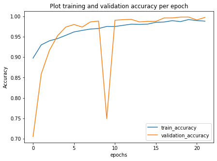
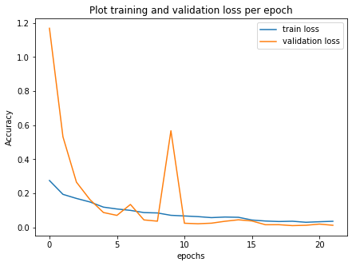
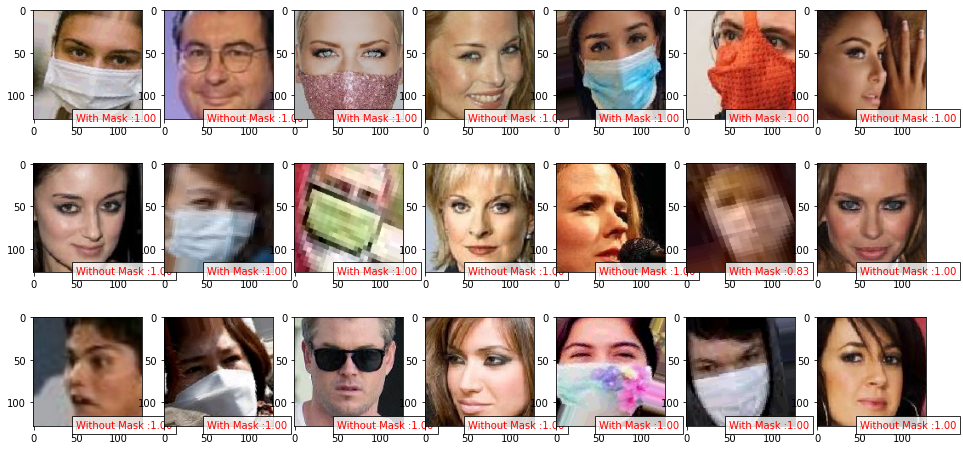
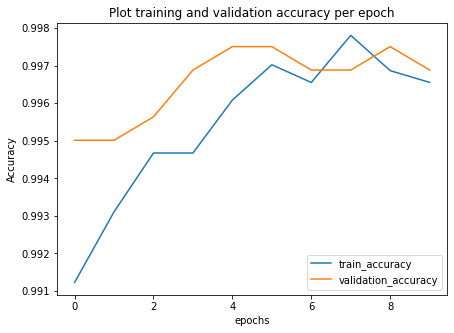
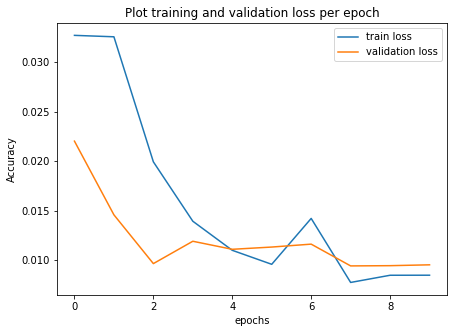
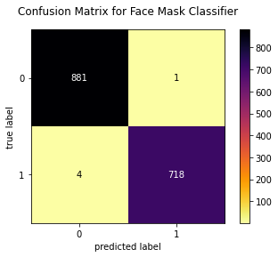
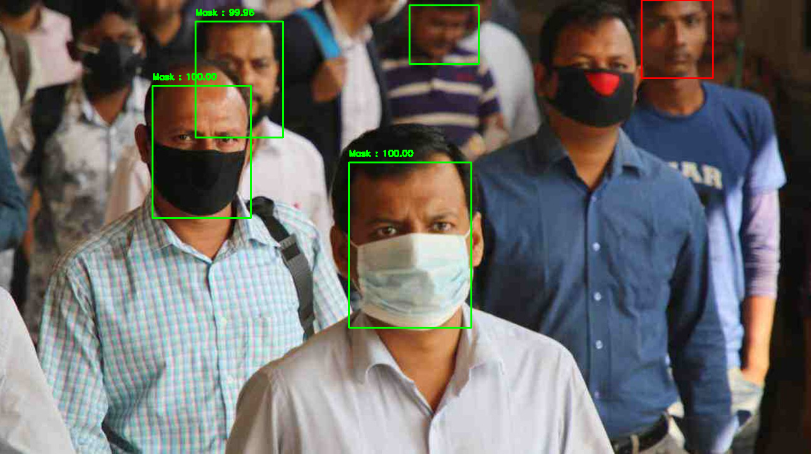

## Tata_Innoverse_SolverHunt8 😷    <a href="https://twitter.com/intent/tweet?text=Face %20mask%20classification%20and%20Social%20Distancing%20Detector%20challenge%20Using%20Python%20Tensorflow%20Keras%20🤩&url=https://github.com/hritik5102/Tata_Innoverse_SolverHunt8s&hashtags=MachineLearning,100DaysofML,Python" target="_blank"></a>
 <br>

 <br>
    

## Content

- [Face mask classification using custom model](#Face-mask-classification-using-custom-model)
- [Face mask classification using MobileNetV2](#Face-mask-classification-using-custom-model)
- [Face mask detector](#Face-mask-detector)
- [Social Distancing Detector](#Social-Distancing-Detector)
- [Features](#features)
- [Clone git repository](#Clone-git-repository)
- [Google colab notebook](#Google-colab-notebook)
- [Reference](#reference)
- [License](#License)
- [Contributor](#Contributor)

### Load data

Download the dataset by visiting the [Face mask dataset](https://drive.google.com/file/d/1bjLMQ8QxIQZ6jar5EhrhRGl5JP83PNZ8/view?usp=sharing) and click the “Download” button.

<hr/>

### **`Folder structure`**

<hr/>

📁 Face Mask Dataset <br/>
&nbsp;&nbsp;&nbsp;&nbsp;&nbsp;&nbsp;&nbsp;&nbsp;&nbsp; 📁 Training <br/>
&nbsp;&nbsp;&nbsp;&nbsp;&nbsp;&nbsp;&nbsp;&nbsp;&nbsp; 📁 Validation <br/>
&nbsp;&nbsp;&nbsp;&nbsp;&nbsp;&nbsp;&nbsp;&nbsp;&nbsp; 📁 Testing <br/>

      |__ Training
        |______ WithMask: [Mask.1.jpg, Mask.2.jpg, Mask.3.jpg ....]
        |______ NO_Mask: [NO_Mask.1.jpg, NO_Mask.2.jpg, NO_Mask.3.jpg ...]

      |__ Validation
        |______ WithMask: [Mask.1.jpg, Mask.2.jpg, Mask.3.jpg ....]
        |______ NO_Mask: [NO_Mask.1.jpg, NO_Mask.2.jpg, NO_Mask.3.jpg ...]

      |__ testing
        |______ [test.1.jpg, test.2.jpg, test.3.jpg , test.4.jpg , test.5.jpg , ....]

## Face mask classification using custom model

<table>
  <tr>
    <td align="center">Training and validation accuracy</td>
     <td align="center">Training and validation loss</td>
  </tr>
  <tr>
    <td></td>
    <td></td>
  </tr>
 </table>

### Output prediction

<p align="center">

</p>

## Face mask classification using MobileNetV2

<table>
  <tr>
    <td align="center">Training and validation accuracy</td>
     <td align="center">Training and validation loss</td>
  </tr>
  <tr>
    <td></td>
    <td></td>
  </tr>
 </table>

### Output prediction

<p align="center">

</p>

### Classification report

```
              precision    recall  f1-score   support

    WithMask       1.00      1.00      1.00       882
 WithoutMask       1.00      0.99      1.00       722

    accuracy                           1.00      1604
   macro avg       1.00      1.00      1.00      1604
weighted avg       1.00      1.00      1.00      1604
```

### Confusion matrix

<p align="center">

</p>

## Face mask detector

### Mask detection on image

<table>
  <tr>
    <td>Input Image-01</td>
    <td>Input Image-02</td>

  </tr>
  <tr>
    <td></td>
    <td></td>
  </tr>
 </table>

### Real time face mask detecting

<div align="center" style="height:400px"> 

<h4><a href="https://www.youtube.com/watch?v=U66yhmRA2zU">Video source :- Why are some wearing face masks and others not?</a></h4>
</div>

## Social Distancing Detector

<div align="center" style="height:400px"> 

<h4><a href="https://www.youtube.com/watch?v=aUdKzb4LGJI">Video source :- Pedestrian overpass - original video (sample)</a></h4>
</div>

## Features

- live video surveillance to fight against covid-19 spread
- The project can be integrated with embedded systems for application in airports, railway stations, offices, schools, and public places to ensure that public safety guidelines are followed.
- Real time face mask detection and for social distancing tracking the crowd movement across the day time.
- Hot-spot area can be monitored by security forces from central station.
- If AI based solution used by authority then there will be less chance get infected security forces.

## Clone git repository

```sh
    $ Git clone "https://github.com/hritik5102/Tata_Innoverse_SolverHunt8"
```

## Google colab notebook

| Filename                                    | Notebook                                                                                                                                                                                                                                           |
| ------------------------------------------- | -------------------------------------------------------------------------------------------------------------------------------------------------------------------------------------------------------------------------------------------------- |
| Face mask classification using custom model | [](https://colab.research.google.com/github/hritik5102/Tata_Innoverse_SolverHunt8/blob/master/Face_Mask_Classification_Custom_model/Face_Mask_Classification.ipynb)      |
| Face mask classification using MobileNetv2  | [](https://colab.research.google.com/github/hritik5102/Tata_Innoverse_SolverHunt8/blob/master/Face_Mask_Classification_MobileNetV2_model/Train_face_mask_Detector.ipynb) |
| Face mask Detection on image                | [](https://colab.research.google.com/github/hritik5102/Tata_Innoverse_SolverHunt8/blob/master/Face_Mask_Detection/Detect_Face_Mask_Image.ipynb)                          |
| Face mask Detection on video                | [](https://colab.research.google.com/github/hritik5102/Tata_Innoverse_SolverHunt8/blob/master/Face_Mask_Detection/Detect_Face_Mask_Video.ipynb)                          |
| Social distancing detector                  | [](https://colab.research.google.com/github/hritik5102/Tata_Innoverse_SolverHunt8/blob/master/Social_Distancing_Detector/Real_time_social_distancing.ipynb)              |

## Reference

- [Pyimagesearch - face mask detector with opencv keras tensorflow and deep learning](https://www.pyimagesearch.com/2020/05/04/covid-19-face-mask-detector-with-opencv-keras-tensorflow-and-deep-learning/)

- [Pyimagesearch - opencv social distancing detector](https://www.pyimagesearch.com/2020/06/01/opencv-social-distancing-detector/)

## License

Licensed under the [MIT License](LICENSE)

## Contributor

<p align="center">

|                                                                                                                                                                                                                   <a href="https://hritik5102.github.io/"></a>                                                                                                                                                                                                                    |
| :--------------------------------------------------------------------------------------------------------------------------------------------------------------------------------------------------------------------------------------------------------------------------------------------------------------------------------------------------------------------------------------------------------------------------------------------------------------------------------------------------------------------------------------------------------------------------: |
|                                                                                                                                                                                                                                                             **[Hritik Jaiswal](https://hritik5102.github.io/)**                                                                                                                                                                                                                                                              |
| <a href="https://twitter.com/imhritik_dj"></a> <a href="https://github.com/hritik5102"></a> <a href="https://www.facebook.com/hritik.jaiswal.56808"></a> <a href="https://www.linkedin.com/in/hritik-jaiswal-22a136166/"></a> |

<hr/>

```bash
╔═╗╔╦╗╔═╗╦ ╦  ╦ ╦╔═╗╔╦╗╔═╗
╚═╗ ║ ╠═╣╚╦╝  ╠═╣║ ║║║║║╣
╚═╝ ╩ ╩ ╩ ╩   ╩ ╩╚═╝╩ ╩╚═╝
╔═╗╔╦╗╔═╗╦ ╦  ╔═╗╔═╗╔═╗╔═╗
╚═╗ ║ ╠═╣╚╦╝  ╚═╗╠═╣╠╣ ║╣
╚═╝ ╩ ╩ ╩ ╩   ╚═╝╩ ╩╚  ╚═╝
```

</p>
